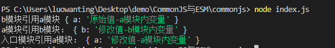
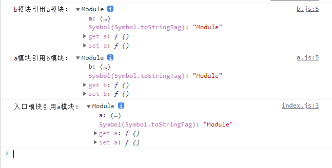
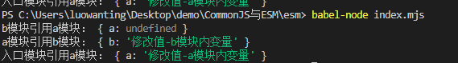

---

# 设置作者
author: Avery
# 设置写作时间
date: 2022-07-25
# 一个页面可以有多个分类
category:
  - JavaScript
# 一个页面可以有多个标签
tag:
  - JavaScript
  - CommonJS
  - ES Module
# 此页面会在文章列表置顶
sticky: true
# 此页面会出现在首页的文章板块中
star: true
# 你可以自定义页脚
footer: 
---

# CommonJS 与 ES Module 的区别

我们都知道 CommonJS 与 ES Module 是前端中最常使用的模块化规范

Common JS 是针对服务端的 js，也就是 node.js ESM 是针对浏览器的

## CommonJS

### 基本使用

```js
// index.js 导入
const a = require("./a.js");
console.log("运行入口模块");
console.log(a);

// a.js 导出
exports.a = "a模块";
console.log("运行a模块");
```

我们使用`require`函数作模块的引入，使用`exports`对象来做模块的导出，这里的`require` `exports`正是 CommmonJS 规范提供给我们的，使用断点调试，可以看到这几个核心变量：

1. exports 记录当前模块导出的变量
2. module 记录当前模块的详细信息
3. require 进行模块的导入

#### exports 导出与 module.exports 的区别

虽然他们都指向的是同一块内存，但是使用并不等价

1. 当帮 i 的那个一个属性时，两者相同

   ```
   exports.a='a'
   module.exports.b='b'
   ```

2. 不能直接赋值给 exports，也就是不能直接使用 exports={}这种语法

   ```
   // 失败
   exports = {propA:'A'};
   // 成功
   module.exports = {propB:'B'};
   ```

   虽然两者指向同一块内存，但最后被导出的是 module.exports，所以不能直接赋值给 exports。

   同样的道理，只要最后直接给 module.exports 赋值了，之前绑定的属性都会被覆盖掉。

   ```
   exports.propA = 'A';
   module.exports.propB = 'B';
   module.exports = {propC:'C'};
   ```

   用上面的例子所示，先是绑定了两个属性 propA 和 propB，接着给 module.exports 赋值，最后能成功导出的只有 propC。

#### require 导入

CommonJS 的引入特点是值的拷贝，简单来说就是把导出值复制一份，放到一块新的内存中。

## ES Module

ES Module 使用 import 命令来做导入，使用 export 来做导出

1. 普通导入、导出

   ```
   // index.mjs
   import {propA, propB,propC, propD} from './a.mjs'

   // a.mjs
   const propA = 'a';
   let propB = () => {console.log('b')};
   var propC = 'c';

   export { propA, propB, propC };
   export const propD = 'd'
   ```

   使用 export 导出可以写成一个对象合集，也可以是一个单独的变量，需要和 import 导入的变量名字一一对应

2. 默认导入、导出

   ```
   // 导入函数
   import anyName from './a.mjs'
   export default function () {
       console.log(123)
   }

   // 导入对象
   import anyName from './a.mjs'
   export default {
     name:'niannian';
     location:'guangdong'
   }

   // 导入常量
   import anyName from './a.mjs'
   export default 1
   ```

   使用 export default 语法可以实现默认导出，可以是一个函数、一个对象，或者仅一个常量。默认的意思是，使用 import 导入时可以使用任意名称，

3. 混合导入、导出

   ```
   // index.mjs
   import anyName, { propA, propB, propC, propD } from './a.mjs'
   console.log(anyName,propA,propB,propC,propD)

   // a.mjs
   const propA = 'a';
   let propB = () => {console.log('b')};
   var propC = 'c';
   // 普通导出
   export { propA, propB, propC };
   export const propD = 'd'
   // 默认导出
   export default function sayHello() {
       console.log('hello')
   }
   ```

4. 全部导入

   ```text
   // index.mjs
   import * as resName from './a.mjs'
   console.log(resName)

   // a.mjs
   const propA = 'a';
   let propB = () => {console.log('b')};
   var propC = 'c';
   // 普通导出
   export { propA, propB, propC };
   export const propD = 'd'
   // 默认导出
   export default function sayHello() {
       console.log('hello')
   }
   ```

5. 重命名导入

   ```text
   // index.mjs
   import {  propA  as renameA,   propB as renameB, propC as renameC , propD as renameD } from './a.mjs'
   const propA = 'a';
   let propB = () => {console.log('b')};
   var propC = 'c';

   // a.mjs
   export { propA, propB, propC };
   export const propD = 'd'
   ```

6. 重定向导出

   ```text
   export * from './a.mjs' // 第一种
   export { propA, propB, propC } from './a.mjs' // 第二种
   export { propA as renameA, propB as renameB, propC as renameC } from './a.mjs' //第三种
   ```

那他们的区别在哪呢：

## 区别

1. 两者的模块导入导出语法不同：CommonJS 是 module.exports,exports 导出，require 导入；而 ESM 是 export 导出，import 导入。

2. CommonJS 是运行时加载模块，ESM 在静态编译期间就确定模块依赖

3. ESM 在编译期间会将 import 语句提升到顶部，CommonJS 不会提升 require

4. CommonJS 导出的是值的拷贝，会对加载结果进行缓存，一旦内部再修改这个值，则不会同步到外部。（CommonJS 不会循环引用就是因为这个特性）而 ESM 是值的引用，内部的修改可以同步到外部。

5. 两者的循环导入的实现原理不同，CommonJS 是当模块遇到循环加载时，返回的是当前已经执行的部分值，而不是代码全部执行后的值，两者会有差异，所以，输入变量时，必须非常小心，ESM 是动态引用，如果使用 import 从一个模块加载变量（即 `import foo from 'foo'`），那些变量不会被缓存，而是成为一个指向被加载模块的引用，需要开发者自己保证，真正取值的时候能够取到值。

6. CommonJS 中顶层的 this 指向模块本身，而 ESM 顶层 this 指向 undefined

7. CommonJS 是单个值导出，ESM 可以导出多个

8. CommonJS 中的一些顶层变量在 ESM 中不存在如 `arguments` `require` `module` `exports` `_filename`

## CommonJS 和 ES Module 模块循环依赖为什么不会导致死循环，它们的解决方法有什么不同

### CommonJS 的循环引用

```
//index.js
var a = require('./a')
console.log('入口模块引用a模块：',a)

// a.js
exports.a = '原始值-a模块内变量'
var b = require('./b')
console.log('a模块引用b模块：',b)
exports.a = '修改值-a模块内变量'

// b.js
exports.b ='原始值-b模块内变量'
var a = require('./a')
console.log('b模块引用a模块',a)
exports.b = '修改值-b模块内变量'
```

结果如下：



依旧使用断点调试，可以看到变量 require 上有一个属性`cache`，这就是模块缓存

一行行来看执行过程，

1. 【入口模块】开始执行，把入口模块加入缓存，
2. var a = require('./a') 执行 将 a 模块加入缓存，进入 a 模块，
3. 【a 模块】exports.a = '原始值-a 模块内变量'执行，a 模块的缓存中给变量 a 初始化，为原始值，
4. 执行 var b = require('./b')，将 b 模块加入缓存，进入 b 模块
5. 【b 模块】exports.b ='原始值-b 模块内变量'，b 模块的缓存中给变量 b 初始化，为原始值，
6. var a = require('./a')，尝试导入 a 模块，发现已有 a 模块的缓存，所以不会进入执行，而是直接取 a 模块的缓存，此时打印`{ a: '原始值-a模块内变量' }`,
7. exports.b = '修改值-b 模块内变量 执行，将 b 模块的缓存中变量 b 替换成修改值，
8. 【a 模块】console.log('a 模块引用 b 模块：',b) 执行，取缓存中的值，打印`{ b: '修改值-b模块内变量' }`
9. exports.a = '修改值-a 模块内变量' 执行，将 a 模块缓存中的变量 a 替换成修改值，
10. 【入口模块】console.log('入口模块引用 a 模块：',a) 执行，取缓存中的值，打印`{ a: '修改值-a模块内变量' }`

上面就是对循环引用的处理过程，循环引用无非是要解决两个问题，怎么避免死循环以及输出的值是什么。CommonJS 通过模块缓存来解决：每一个模块都先加入缓存再执行，每次遇到 require 都先检查缓存，这样就不会出现死循环；借助缓存，输出的值也很简单就能找到了。

#### **多次引入**

同样由于缓存，一个模块不会被多次执行，来看下面这个例子：入口模块引用了 a、b 两个模块，a、b 这两个模块又分别引用了 c 模块，此时并不存在循环引用，但是 c 模块被引用了两次。

```text
//index.js
var a = require('./a')
var b= require('./b')

// a.js
module.exports.a = '原始值-a模块内变量'
console.log('a模块执行')
var c = require('./c')

// b.js
module.exports.b = '原始值-b模块内变量'
console.log('b模块执行')
var c = require('./c')

// c.js
module.exports.c = '原始值-c模块内变量'
console.log('c模块执行')
```

结果如下：

a 模块执行

c 模块执行

b 模块执行

可以看到，c 模块只被执行了一次，当第二次引用 c 模块时，发现已经有缓存，则直接读取，而不会再去执行一次

#### **路径解析规则**

路径解析规则也是面试常考的一个点，或者说，为什么我们导入时直接简单写一个'react'就正确找到包的位置。

仔细观察 module 这个变量，可以看到还有一个属性`paths`

先把路径作一个简单分类：内置的核心模块、本地的文件模块和第三方模块。

1. 对于核心模块，node 将其已经编译成二进制代码，直接书写标识符 fs、http 就可以
2. 对于自己写的文件模块，需要用‘./’'../'开头，require 会将这种相对路径转化为真实路径，找到模块
3. 对于第三方模块，也就是使用 npm 下载的包，就会用到`paths`这个变量，会依次查找当前路径下的 node_modules 文件夹，如果没有，则在父级目录查找 no_modules，一直到根目录下，找到为止。

在 node_modules 下找到对应包后，会以 package.json 文件下的 main 字段为准，找到包的入口，如果没有 main 字段，则查找 index.js/index.json/index.node

### ESM

ES module 导出的是一个索引——内存地址，没有办法这样处理。它依赖的是“模块地图”和“模块记录”，模块地图在下面会解释，而模块记录是好比每个模块的“身份证”，记录着一些关键信息——这个模块导出值的的内存地址，加载状态，在其他模块导入时，会做一个“连接”——根据模块记录，把导入的变量指向同一块内存，这样就是实现了动态绑定，

```
// index.mjs
import * as a from './a.js'
console.log('入口模块引用a模块：', a)

// a.mjs
let a = "原始值-a模块内变量"
export { a }
import * as b from "./b.js"
console.log("a模块引用b模块：", b)
a = "修改值-a模块内变量"

// b.mjs
let b = "原始值-b模块内变量"
export { b }
import * as a from "./a.js"
console.log("b模块引用a模块：", a)
b = "修改值-b模块内变量"
```

浏览器的执行结果：



Node 的执行结果



在浏览器中：

ES6 在浏览器中要在`<script type="module" src="./index.mjs" ></script>`加上 type="module"，但是加上之后就有一个默认条件就是它会按照 defer 的顺序执行

在 Node 中：

可以看到，在 b 模块中引用 a 模块时，得到的值是 undefined，接下来一步步分析代码的执行。

在代码执行前，首先要进行预处理，这一步会根据 import 和 export 来构建模块地图（Module Map），它类似于一颗树，树中的每一个“节点”就是一个模块记录，这个记录上会标注导出变量的内存地址，将导入的变量和导出的变量连接，即把他们指向同一块内存地址。不过此时这些内存都是空的，也就是看到的 undefined。

接下来就是代码的一行行执行，import 和 export 语句都是只能放在代码的顶层，也就是说不能写在函数或者 if 代码块中。

1. 【入口模块】首先进入入口模块，在模块地图中把入口模块的模块记录标记为“获取中”（Fetching），表示已经进入，但没执行完毕，
2. import \* as a from './a.mjs' 执行，进入 a 模块，此时模块地图中 a 的模块记录标记为“获取中”
3. 【a 模块】import \* as b from './b.mjs' 执行，进入 b 模块，此时模块地图中 b 的模块记录标记为“获取中”，
4. 【b 模块】import \* as a from './a.mjs' 执行，检查模块地图，模块 a 已经是 Fetching 态，不再进去，
5. let b = '原始值-b 模块内变量' 模块记录中，存储 b 的内存块初始化，
6. console.log('b 模块引用 a 模块：', a) 根据模块记录到指向的内存中取值，是{ a: }
7. b = '修改值-b 模块内变量' 模块记录中，存储 b 的内存块值修改
8. 【a 模块】let a = '原始值-a 模块内变量' 模块记录中，存储 a 的内存块初始化，
9. console.log('a 模块引用 b 模块：', b) 根据模块记录到指向的内存中取值，是{ b: '修改值-b 模块内变量' }
10. a = '修改值-a 模块内变量' 模块记录中，存储 a 的内存块值修改
11. 【入口模块】console.log('入口模块引用 a 模块：',a) 根据模块记录，到指向的内存中取值，是{ a: '修改值-a 模块内变量' }
