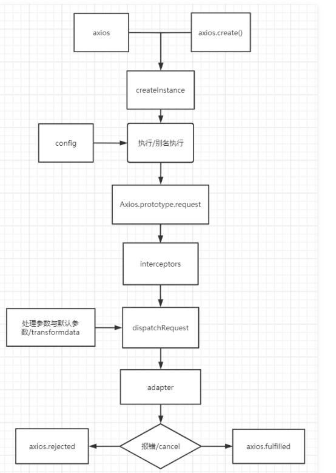

---

# 设置作者
author: Avery
# 设置写作时间
date: 2022-07-18
# 一个页面可以有多个分类
category:
  - Vue
# 一个页面可以有多个标签
tag:
  - Vue
  - Axios
# 此页面会在文章列表置顶
sticky: true
# 此页面会出现在首页的文章板块中
star: true
# 你可以自定义页脚
footer: 
---

# Axios

Axios 是一个基于 _[promise](https://javascript.info/promise-basics)_ 网络请求库，作用于[`node.js`](https://nodejs.org/) 和浏览器中。 它是 _[isomorphic](https://www.lullabot.com/articles/what-is-an-isomorphic-application)_ 的(即同一套代码可以运行在浏览器和 node.js 中)。在服务端它使用原生 node.js `http` 模块, 而在客户端 (浏览端) 则使用 XMLHttpRequests。

## 特性

- 从浏览器创建 [XMLHttpRequests](https://developer.mozilla.org/en-US/docs/Web/API/XMLHttpRequest)

- 从 node.js 创建 [http](http://nodejs.org/api/http.html) 请求

- 支持 [Promise](https://developer.mozilla.org/en-US/docs/Web/JavaScript/Reference/Global_Objects/Promise) API

- 拦截请求和响应

- 转换请求和响应数据

- 取消请求

- 自动转换 JSON 数据

- 客户端支持防御[XSRF](http://en.wikipedia.org/wiki/Cross-site_request_forgery)

## Axios API

可以向 `axios` 传递相关配置来创建请求

```vue
// 发起一个post请求 axios({ method: 'post', url: '/user/12345', data: {
firstName: 'Fred', lastName: 'Flintstone' } });
```

```
// 在 node.js 用GET请求获取远程图片
axios({
  method: 'get',
  url: 'http://bit.ly/2mTM3nY',
  responseType: 'stream'
})
  .then(function (response) {
    response.data.pipe(fs.createWriteStream('ada_lovelace.jpg'))
  });
```

##### axios(url[, config])

```
// 发起一个 GET 请求 (默认请求方式)
axios('/user/12345');
```

### 请求方式别名

为了方便起见，已经为所有支持的请求方法提供了别名。

##### axios.request(config)

##### axios.get(url[, config])

##### axios.delete(url[, config])

##### axios.head(url[, config])

##### axios.options(url[, config])

##### axios.post(url[, data[, config]])

##### axios.put(url[, data[, config]])

##### axios.patch(url[, data[, config]])

###### 注意

在使用别名方法时， `url`、`method`、`data` 这些属性都不必在配置中指定。

## 实现一个简单版 Axios

```javascript
class Axios {
  constructor() {
    // 实现axios.interceptors.response.use和axios.interceptors.request.use
    this.interceptors = {
      request: new InterceptorsManage(),
      response: new InterceptorsManage(),
    };
  }
  request(config) {
    /*
            先是 mergeConfig ... 等，不再阐述
  		*/
    // Hook up interceptors middleware 创建拦截器链. dispatchRequest 是重中之重，后续重点
    //   dispatchRequest===this.sendAjax.bind(this)
    let chain = [this.sendAjax.bind(this), undefined];

    //    请求拦截
    // push各个拦截器方法 注意：interceptor.fulfilled 或 interceptor.rejected 是可能为undefined
    this.interceptors.request.handlers.forEach((interceptors) => {
      // 请求拦截器逆序 注意此处的 forEach 是自定义的拦截器的forEach方法
      chain.unshift(interceptors.fullfield, interceptors.rejected);
    });

    // 响应拦截
    this.interceptors.response.handlers.forEach((interceptors) => {
      // 响应拦截器顺序 注意此处的 forEach 是自定义的拦截器的forEach方法
      chain.push(interceptors.fullfield, interceptors.rejected);
    });

    // 初始化一个promise对象，状态为resolved，接收到的参数为已经处理合并过的config对象
    // 执行队列，每次执行一对，并给promise赋最新的值
    let promise = Promise.resolve(config);

    // 循环拦截器的链
    while (chain.length > 0) {
      promise = promise.then(chain.shift(), chain.shift()); // 每一次向外弹出拦截器
    }
    return promise;
  }
  sendAjax(config) {
    return new Promise((resolve) => {
      const { url = "", method = "get", data = {} } = config;
      const xhr = new XMLHttpRequest();
      xhr.open(method, url, true);
      xhr.onload = function () {
        console.log(xhr.responseText);
        resolve(xhr.responseText);
      };
      xhr.send(data);
    });
  }
}
```

将 Axios.prototype 上的方法搬运到 request 上

```javascript
function CreateAxiosFn() {
  let axios = new Axios();
  let req = axios.request.bind(axios);
  utils.extend(req, Axios.prototype, axios);
  // 当执行axios.interceptors.response.use和axios.interceptors.request.use的时候，实现获取axios实例上的interceptors对象，然后获取response或request拦截器，再执行对应的拦截器的use方法
  utils.extend(req, axios);
  return req;
}

let axios = CreateAxiosFn();

const methodArr = ["get", "delete", "head", "options", "put", "patch", "post"];
methodArr.forEach((met) => {
  Axios.prototype[met] = function () {
    console.log("执行" + met + "方法");
    if (["get", "delete", "head", "options"].includes(met)) {
      return this.request({
        method: met,
        url: arguments[0],
        ...(arguments[1] || {}),
      });
    } else {
      return this.request({
        method: met,
        url: arguments[0],
        data: arguments[1] || {},
        ...(arguments[2] || {}),
      });
    }
  };
});
```

```js
//首先实现一个工具类，实现将b方法混入a，并且修改this指向
const utils = {
  extend(a, b, context) {
    for (let key in b) {
      if (b.hasOwnProperty(key)) {
        if (typeof b[key] === "function") {
          a[key] = b[key].bind(context);
        } else {
          a[key] = b[key];
        }
      }
    }
  },
};
```

构建拦截器的构造函数

```
class InterceptorsManage{
    constructor(){
        this.handlers=[]
    }
    use(fullfield,rejected){
        this.handlers.push({
            fullfield,
            rejected
        })
    }
}

```

# 小结



参考文献：https://cloud.tencent.com/developer/article/1794288
