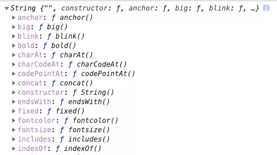

---

# 设置作者
author: Avery
# 设置写作时间
date: 2022-07-13
# 一个页面可以有多个分类
category:
  - 零碎的文章
# 一个页面可以有多个标签
tag:
  - 零碎的文章
  - JavaScript
  - 对象装箱和拆箱
# 此页面会在文章列表置顶
sticky: true
# 此页面会出现在首页的文章板块中
star: true
# 你可以自定义页脚
footer: 
---

# 如何让{}==1，JavaScript 中的装箱和拆箱


首先我们可以看到在浏览器中，{}==1 是为 false，那怎么才能让他为 true 呢？

试试下面的代码

```
Object.prototype.valueOf=()=>1
console.log({}==1)
```


JavaScript 有两种数据类型

基本数据类型：字符串（String）、数字(Number)、布尔(Boolean)、空（Null）、未定义（Undefined）、Symbol

引用类型：对象(Object)、数组(Array)、函数(Function)

在 js 中，有四个基本的包装类型 String、Number、Boolean、Symbol

## 装箱操作

所谓装箱就是将基本数据类型转换为对应的引用类型的操作。

装箱分隐式装箱和显式装箱两种方式

### 隐式装箱

隐式装箱由 **引擎自动执行**

```
let a=123 
```

基本类型是不能添加属性和方法的，添加会报错。

```
let a="js"
a.subText="vue"
a.subTextfn=()=>{
	console.log('react')
}
console.log(a.subText)
console.log(a.subTextFn())//Uncaught TypeError: a.subTextFn is not a function
```

那为什么普通的字符串类型可以调用方法呢，比如 a.substring(),a.indexOf()等

这就要提到装箱，在读取值得时候，引擎会创建一个基本类型所对应得 **包装类型的对象**



隐式装箱的执行步骤

```
let s1="s1"//隐式装箱
let s2=s1.substring(2)
```

执行步骤:

(1) 先创建 String 类型的一个实例

(2)在实例中调用制定的方法

(3)销毁这个实例

上面的三个步骤转换为代码，如下：

```
// 1
let s1 = new String('s1');
// 2
let s2 = s1.substring(2);
// 3
s1 = null;
```

所以我们在基本类型上可以使用方法，是因为有隐式装箱操作。

隐式装箱当读取一个基本类型值时，后台会创建一个该基本类型所对应的基本包装类型对象。在这个基本类型的对象上调用方法，其实就是在这个包装类型的对象调用方法，这个基本包装类型的对象是临时的，它只存在于方法调用那一行代码执行的瞬间，执行方法后立即被销毁。这也就是在基本类型上添加属性和方法会不识别或报错的原因

### 显式装箱

显示装箱通过基本包装类型对象对基本类型进行显示装箱

```
let s1 = new String('s1');
```

## 拆箱

拆箱和装箱相反了，拆箱是指把引用类型转换为基本的数据类型。通常通过引用类型的 `valueOf()`和`toString()`方法来实现

引用类型的值转换成基本类型的值就是拆箱，拆箱必须要提两个方法 toString() 和 valueOf() ，toString() 返回字符串，valueOf() 返回对象本身。

```
//更改对象的 toString() 和 valueOf() 两个方法：
var web = {
  'name':'html',
  valueOf: () => {
    console.log("valueOf");
  },
  toString: () => {
    console.log("toString");
  }
}
console.log(String(web))//toString undefined
console.log(Number(web))//valueOf NaN
```

为什么有时候先走了 valueOf() 有时候先执行 toString()

对象中有 toPrimitive 方法，此方法提供了用于将对象强制换为基元并替换 toString()和 valueOf()方法的通用接口

运行方法时，判断 preferredType 的值是哪种类型：

如果是 Number：

(1)如果是基本类型,则按原样返回。

(2)否则，输入的是一个对象，调用 obj.valueOf()方法，如果结果是原始的，则将其返回。

(3)否则，调用 obj.toString()方法，如果结果是原始数据，则将其返回

(4)否则，抛出 TypeError

如果是 String，则调换(2)(3)

如果没有 PreferredType，对于 Date 的实例将其设置为 String。

对于所有其他值，设置为 Number
