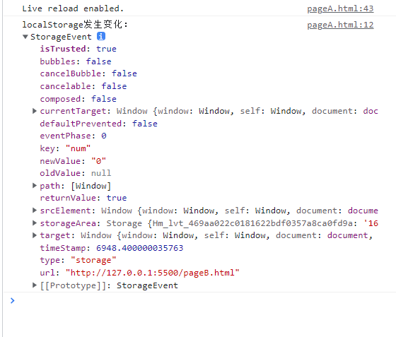
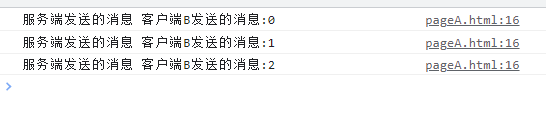
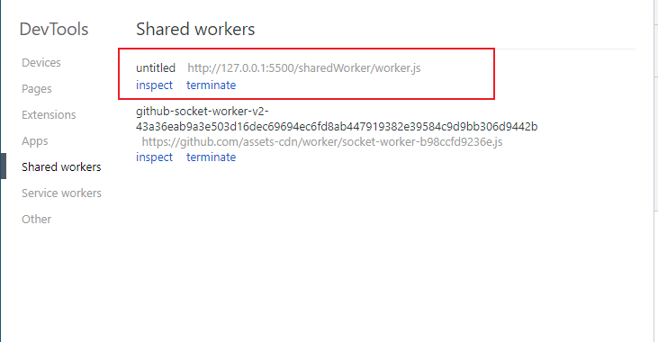
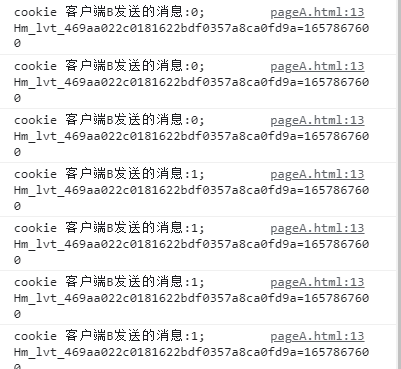
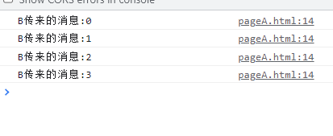
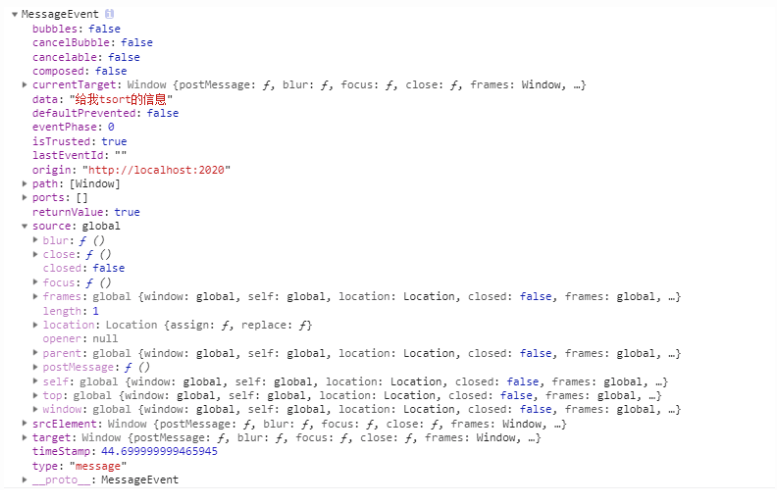
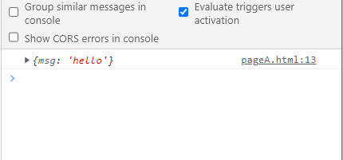
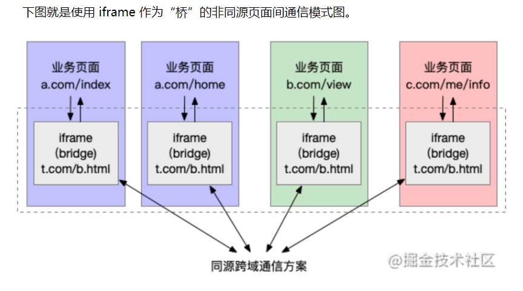

---

# 设置作者
author: Avery
# 设置写作时间
date: 2022-07-18
# 一个页面可以有多个分类
category:
  - 浏览器
# 一个页面可以有多个标签
tag:
  - 浏览器
  - Vue3
  - jsx/tsx
# 此页面会在文章列表置顶
sticky: true
# 此页面会出现在首页的文章板块中
star: true
# 你可以自定义页脚
footer: 
---

# 实现浏览器多标签页通信

## localStorage实现通信

localStrorage的特点：

- 同域共享存储空间
- 持久化将数据存储浏览器
- 提供事件监听localStorage变化

也就是说如果多个标签页跨域了，那么数据将无法共享。

示例：

```html
//pageA.html
<!DOCTYPE html>
<html lang="en">
<head>
    <meta charset="UTF-8">
    <meta http-equiv="X-UA-Compatible" content="IE=edge">
    <meta name="viewport" content="width=device-width, initial-scale=1.0">
    <title>Document</title>
</head>
<body>
    <script>
        window.addEventListener("storage", (e) => {
            console.info("localStorage发生变化：", e)
        })
    </script>
</body>
</html>
```

```html
//pageB.html
<!DOCTYPE html>
<html lang="en">
<head>
    <meta charset="UTF-8">
    <meta http-equiv="X-UA-Compatible" content="IE=edge">
    <meta name="viewport" content="width=device-width, initial-scale=1.0">
    <title>Document</title>
</head>
<body>
    <h1>pageB</h1>
    <button id="btnB">添加数据到localStorage</button>

</body>
<script>
    let btnB = document.getElementById("btnB");
    let num = 0;
    btnB.addEventListener("click", () => {
        localStorage.setItem("num", num++)
    })
</script>
</html>
```

点击b页面的按钮之后，A页面输出



可以看到在pageA中不仅可以拿到改变后的值，还可以拿到改变之前的值。通过这种方式，我们就可以将两个页面的数据进行同步了。

**注意点：**

- pageA和pageB同源，即域名、端口、协议等都是相同的。
- 使用storage事件监听localStorage变化

如果只是需要两个页面之间数据共享，那么可以不使用storage监听方法，直接通过localStorage.getItem()获取即可。

## webSocket

**webSocket的特点：**

- 保持连接状态，HTTP协议是无状态连接，即请求完毕后就会关闭连接
- 全双工通信，客户端和服务端平等对待，可以互相通信
- 建立在TCP协议之上
- 没有同源共享策略，即可实现跨域共享

用websocket实现浏览器多页通信

假如我们的A、B页面都与服务器建立了websocket连接，那么两个页面都可以实时接收服务器发来的消息，也可以实时向服务端发送消息。如果A页面更改了数据，那么向服务端发送一条消息或数据，服务端将这条数据或消息发送给B页面，类似于”中介“

实例：

我们先来搭建一个简单的websocket服务器，用于pageA和pageB的连接，新建index.js文件。

**初始化命令：**

```coffeescript
npm init -y
npm install --save ws
运行命令：node index.js
```

**代码如下：**

index.js

```js
let WebSocketServer=require("ws").Server
let wss=new WebSocketServer({port:3000})

// 创建保存所有已连接到服务器的客户端对象的数组
let clients=[]

wss.on("connection",function(client){
    console.log("一个客户端连接到服务器");
    if(clients.indexOf(client)===-1){
        clients.push(client)
        client.on("message",function(msg){
            console.log("收到消息:" + msg)
            for(let key of clients){
                if(key!==client){
                    key.send(msg.toString())
                }
            }
        })
    }
})


```

```html
//pageA
<!DOCTYPE html>
<html lang="en">
<head>
    <meta charset="UTF-8">
    <meta http-equiv="X-UA-Compatible" content="IE=edge">
    <meta name="viewport" content="width=device-width, initial-scale=1.0">
    <title>Document</title>
</head>
<body>
    <script>
        var ws=new WebSocket('ws://localhost:3000/');
        ws.open=function(){
             console.log("websocket连接成功")
        }
        ws.onmessage=function(e){
            console.log("服务端发送的消息", e.data)
        }
    </script>
</body>
</html>
```

```html
//pageB
<!DOCTYPE html>
<html lang="en">
<head>
    <meta charset="UTF-8">
    <meta http-equiv="X-UA-Compatible" content="IE=edge">
    <meta name="viewport" content="width=device-width, initial-scale=1.0">
    <title>Document</title>
</head>
<body>
    <h1>pageB</h1>
    <button id="btnB">button</button>
    
</body>
<script>
    let btnB = document.getElementById("btnB");
    let num = 0;
    btnB.addEventListener("click", () => {
        ws.send(`客户端B发送的消息:${num++}`);
    })
    // 创建一个websocket连接
    var ws = new WebSocket('ws://localhost:3000/');
    // WebSocket连接成功回调
    ws.onopen = function () {
        console.log("websocket连接成功B")
    }
</script>
</html>
```

当我们点击pageB中的按钮时，会通过websocket向服务端发送一条消息，服务端接收到这条消息之后，会将消息转发给pageA，这样pageA就得到了pageB传来的数据。



总体来说，原理很简单，只是需要了解websocket。通常情况下，我们不建议使用websocket来进行多标签页通信，因为这回增加服务器的负担。

## SharedWorker

SharedWorker是webWorker中的一种，webWorker可以为JS创造多线程环境，它可以由所有同源页面共享，利用这个特点，实现浏览器的多标签页通信

**sharedWorker特点：**

- 跨域不共享，即多个标签页不能跨域

- 使用port发送和接收消息

- 如果url相同，且是同一个js，那么只会创建一个sharedWorker，多个页面共享这个sharedWorker

  跟webSocket类似

 worker.js

```js

const set = new Set()
onconnect = event => {
    const port = event.ports[0]
    set.add(port)


    // 接收信息
    port.onmessage = e => {
        // 广播信息
        set.forEach(p => {
            p.postMessage(e.data)
        })
    }


    // 发送信息
    port.postMessage("worker广播信息")
}
```

pageA页面

```html
<!DOCTYPE html>
<html lang="en">
<head>
    <meta charset="UTF-8">
    <meta http-equiv="X-UA-Compatible" content="IE=edge">
    <meta name="viewport" content="width=device-width, initial-scale=1.0">
    <title>Document</title>
</head>
<body>
    <script>
        const worker=new SharedWorker('./worker.js')
        worker.port.onmessage=e=>{
            console.log("pageA收到信息",e.data);
        }
    </script>
</body>
</html>
```

pageB页面

```html
<!DOCTYPE html>
<html lang="en">
  <head>
    <meta charset="UTF-8" />
    <meta http-equiv="X-UA-Compatible" content="IE=edge" />
    <meta name="viewport" content="width=device-width, initial-scale=1.0" />
    <title>Document</title>
  </head>
  <body>
    <h1>pageB</h1>
    <button id="btnB">button</button>
  </body>
  <script>
    const worker = new SharedWorker("./worker.js");
    let btnB = document.getElementById("btnB");
    let num = 0;
    btnB.addEventListener("click", () => {
      worker.port.postMessage(`客户端B发送的消息:${num++}`);
    });
  </script>
</html>

```

**调试sharedWorker：**

我们如何查看当前是运行的哪个sharedWorker呢？可以在浏览时输入：chrome://inspect。

找到sharedWorker选项，就可以看到运行的sharedWorker,如下图：



## Cookie + setInterval

cookie可以用来存储数据，而且是同源共享的

cookie的特点：

- 跨域不共享
- 具有存储空间限制
- 请求自动携带cookie

示例：

pageA页面

```html
<!DOCTYPE html>
<html lang="en">
<head>
    <meta charset="UTF-8">
    <meta http-equiv="X-UA-Compatible" content="IE=edge">
    <meta name="viewport" content="width=device-width, initial-scale=1.0">
    <title>Document</title>
</head>
<body>
    <script>
        setInterval(()=>{
            // 加入定时器，让函数每一秒就调用一次，实现页面刷新
            console.log("cookie",document.cookie);
        },1000)
    </script>
</body>
</html>
```

pageB页面

```html
<!DOCTYPE html>
<html lang="en">
<head>
    <meta charset="UTF-8">
    <meta http-equiv="X-UA-Compatible" content="IE=edge">
    <meta name="viewport" content="width=device-width, initial-scale=1.0">
    <title>Document</title>
</head>
<body>
     <h1>pageB</h1>
    <button id="btnB">添加数据到localStorage</button>
</body>

<script>
  let btnB = document.getElementById("btnB");
  let num = 0;
  btnB.addEventListener("click", () => {
    document.cookie = `客户端B发送的消息:${num++}`
  })
</script>
</html>
```



## BroadCast Channel

BroadCast Channel 可以帮我们创建一个用于广播的通信频道。当所有页面都监听同一频道的消息时，其中某一个页面通过它发送的消息就会被其他所有页面收到。

示例：

```html
<!DOCTYPE html>
<html lang="en">
<head>
    <meta charset="UTF-8">
    <meta http-equiv="X-UA-Compatible" content="IE=edge">
    <meta name="viewport" content="width=device-width, initial-scale=1.0">
    <title>Document</title>
</head>
<body>
    <script>
       const bc=new BroadcastChannel('B-Broad')
       bc.onmessage=function(e){
           const data=e.data
           console.log(data);
       }
    </script>
</body>
</html>
```

```html
<!DOCTYPE html>
<html lang="en">
  <head>
    <meta charset="UTF-8" />
    <meta http-equiv="X-UA-Compatible" content="IE=edge" />
    <meta name="viewport" content="width=device-width, initial-scale=1.0" />
    <title>Document</title>
  </head>
  <body>
    <h1>pageB</h1>
    <button id="btnB">button</button>
  </body>
  <script>
    const bc = new BroadcastChannel("B-Broad");
    let btnB = document.getElementById("btnB");
    let num = 0;
    btnB.addEventListener("click", () => {
      bc.postMessage(`B传来的消息:${num++}`)
    });
  </script>
</html>

```



## Service Worker

Service Worker 是一个可以长期运行在后台的 Worker，能够实现与页面的双向通信。多页面共享间的 Service Worker 可以共享，将 Service Worker 作为消息的处理中心（中央站）即可实现广播效果。

示例：

serviceWorker.js

Service Worker 本身并不自动具备“广播通信”的功能，需要我们添加些代码，将其改造成消息中转站：

　我们在 Service Worker 中监听了`message`事件，获取页面（从 Service Worker 的角度叫 client）发送的信息。然后通过`self.clients.matchAll()`获取当前注册了该 Service Worker 的所有页面，通过调用每个client（即页面）的`postMessage`方法，向页面发送消息。这样就把从一处（某个Tab页面）收到的消息通知给了其他页面。

```js
self.addEventListener('message',function(e){
    console.log('service worker收到的消息',e.data);
    e.waitUntil(
        self.clients.matchAll().then(function (clients) {
            if (!clients || clients.length === 0) {
                return;
            }
            clients.forEach(function (client) {
                client.postMessage(e.data);
            });
        })
    );
})
```

pageA

```html
<!DOCTYPE html>
<html lang="en">
  <head>
    <meta charset="UTF-8" />
    <meta http-equiv="X-UA-Compatible" content="IE=edge" />
    <meta name="viewport" content="width=device-width, initial-scale=1.0" />
    <title>Document</title>
  </head>
  <body>
    <script>
      navigator.serviceWorker.register("./serviceWorker.js").then(function () {
        console.log("swA注册成功");
      });
      navigator.serviceWorker.addEventListener("message", function (e) {
        const data = e.data;
        console.log(data);
      });
    </script>
  </body>
</html>

```

pageB

```html
<!DOCTYPE html>
<html lang="en">
  <head>
    <meta charset="UTF-8" />
    <meta http-equiv="X-UA-Compatible" content="IE=edge" />
    <meta name="viewport" content="width=device-width, initial-scale=1.0" />
    <title>Document</title>
  </head>
  <body>
    <h1>pageB</h1>
    <button id="btnB">button</button>
  </body>
  <script>
     navigator.serviceWorker.register('./serviceWorker.js').then(function(){
            console.log("swB注册成功");
        })
    let btnB = document.getElementById("btnB");
    let num = 0;
    btnB.addEventListener("click", () => {
        navigator.serviceWorker.controller.postMessage(`B传来的消息:${num++}`);
    });
  </script>
</html>

```

## postMessage

postMessage是html5引入的API，postMessage()方法允许来自不同源的脚本采用异步的方式进行有效的通信，可以实现跨文本文档，多窗口，跨域消息传递，多用于窗口间数据通信，这也使它成为跨域通信的一种有效解决方案

postMessage()方法用于安全地实现跨源通信。

1、语法：otherWindow.postMessage(message,targetOrigin,[transfer]);

（1）`otherWindow：`其他窗口的一个引用，比如iframe的contentWindow属性、执行window.open返回的窗口对象、或者是命名过或数值索引的window.frames。

（2）`message：`将要发送到其他 window的数据。它将会被结构化克隆算法序列化。这意味着你可以不受什么限制的将数据对象安全的传送给目标窗口而无需自己序列化。

（3）`targetOrigin：`通过窗口的origin属性来指定哪些窗口能接收到消息事件，其值可以是字符串"*"（表示无限制）或者一个URI。

　在发送消息的时候，如果目标窗口的协议、主机地址或端口这三者的任意一项不匹配targetOrigin提供的值，那么消息就不会被发送；

　　只有三者完全匹配，消息才会被发送。

　　这个机制用来控制消息可以发送到哪些窗口；例如，当用postMessage传送密码时，这个参数就显得尤为重要，必须保证它的值与这条包含密码的信息的预期接受者的origin属性完全一致，来防止密码被恶意的第三方截获。

　　如果你明确的知道消息应该发送到哪个窗口，那么请始终提供一个有确切值的targetOrigin，而不是*。不提供确切的目标将导致数据泄露到任何对数据感兴趣的恶意站点。

（4）`transfer`可选：是一串和message 同时传递的 `Transferable` 对象，这些对象的所有权将被转移给消息的接收方，而发送一方将不再保有所有权。

2、**接收数据：监听message事件的发生**

```js
// 执行如下代码, 其他window可以监听分发的message:
window.addEventListener("message", receiveMessage, false);
function receiveMessage(event) {
  var origin = event.origin
  if (origin !== "http://example.org:8080") return;
  // ...
}
```

　message 的属性有:

（1）`data：`从其他 window 中传递过来的对象。

（2）`origin：`调用 `postMessage` 时消息发送方窗口的 origin。

　　这个字符串由 协议、“://“、域名、“ : 端口号”拼接而成。例如 “`https://example.org` (隐含端口 `443`)”、“`http://example.net` (隐含端口 `80`)”、“`http://example.com:8080`”。

　　请注意，这个origin不能保证是该窗口的当前或未来origin，因为postMessage被调用后可能被导航到不同的位置。

（3）`source：`对发送消息的窗口对象的引用，您可以使用此来在具有不同origin的两个窗口之间建立双向通信。

（4）type: 指的是发送消息的类型;

　　event 对象的打印结果截图如下：



示例：

pageB

window.open打开新的页面，postMessage发送请求

```html
<!DOCTYPE html>
<html lang="en">
  <head>
    <meta charset="UTF-8" />
    <meta http-equiv="X-UA-Compatible" content="IE=edge" />
    <meta name="viewport" content="width=device-width, initial-scale=1.0" />
    <title>Document</title>
  </head>
  <body>
    <h1>pageB</h1>
    <button id="btnB">button</button>
  </body>
  <script>
    var newWindow = window.open("http://127.0.0.1:5500/postMessage/pageA.html");
    let num = 0;
    btnB.addEventListener("click", () => {
      newWindow.postMessage({ msg: "hello" }, "*");
    });
  </script>
</html>

```

pageA

监听消息

```html
<!DOCTYPE html>
<html lang="en">
  <head>
    <meta charset="UTF-8" />
    <meta http-equiv="X-UA-Compatible" content="IE=edge" />
    <meta name="viewport" content="width=device-width, initial-scale=1.0" />
    <title>Document</title>
  </head>
  <body>
    <script>
      window.addEventListener("message", (e) => {
        let message = e.data;
        console.log(message);
      });
    </script>
  </body>
</html>

```



这里需要注意一点的就是：postMessage语法 - window.postMessage(msg,targetOrigin)，postMessage要通过 window 对象调用！因为这里的window不只是当前window，大部分使用postMessage的时候，都不是本页面的window，而是其他网页的window！如：

（1）iframe的contentWindow

（2）通过window.open方法打开的新窗口的window

（3）window.opener

（4）如果你使用postMessage时没有带window，那么当然，你就是用的本页面的window来调用了它。

## iframe桥实现跨域通信

实现该功能，可以使用一个用户不可见的iframe作为“桥”，由于iframe与父页面间可以通过指定 `origin`来忽略同源限制，因此可以在每个页面去嵌入一个iframe（例如：`http://sample.com/bridge.html`），而这些 iframe 由于使用的是一个 url，因此属于同源页面，其通信方式可以复用上面第一部分提到的各种方式。

1、页面与 iframe 通信非常简单，首先需要在页面中监听 iframe 发来的消息，做相应的业务处理：

```js
window.addEventListener('message', function (e) {
    // …… do something
});
```

2、然后，当页面要与其他的同源或非同源页面通信时，会先给 iframe 发送消息

```js
window.frames[0].window.postMessage(mydata, '*');
```

其中为了简便此处将`postMessage`的第二个参数设为了`'*'`，你也可以设为 iframe 的 URL。

3、iframe 收到消息后，会使用某种跨页面消息通信技术在所有 iframe 间同步消息，例如下面使用的 Broadcast Channel：

```js
/* iframe 内代码 */
const bc = new BroadcastChannel('A-Broad');
// 收到来自页面的消息后，在 iframe 间进行广播
window.addEventListener('message', function (e) {
    bc.postMessage(e.data);
});    
```

其他 iframe 收到通知后，则会将该消息同步给所属的父页面：

```js
/* iframe 内代码 */
// 对于收到的（iframe）广播消息，通知给所属的业务页面
bc.onmessage = function (e) {
    window.parent.postMessage(e.data, '*');
};
```



## 总结

对于同源页面，常见的方式包括：

- 广播模式：Broadcast Channe / Service Worker / LocalStorage + StorageEvent
- 共享存储模式：Shared Worker / IndexedDB / cookie
- 口口相传模式：window.open + window.opener
- 基于服务端：Websocket / Comet / SSE 等