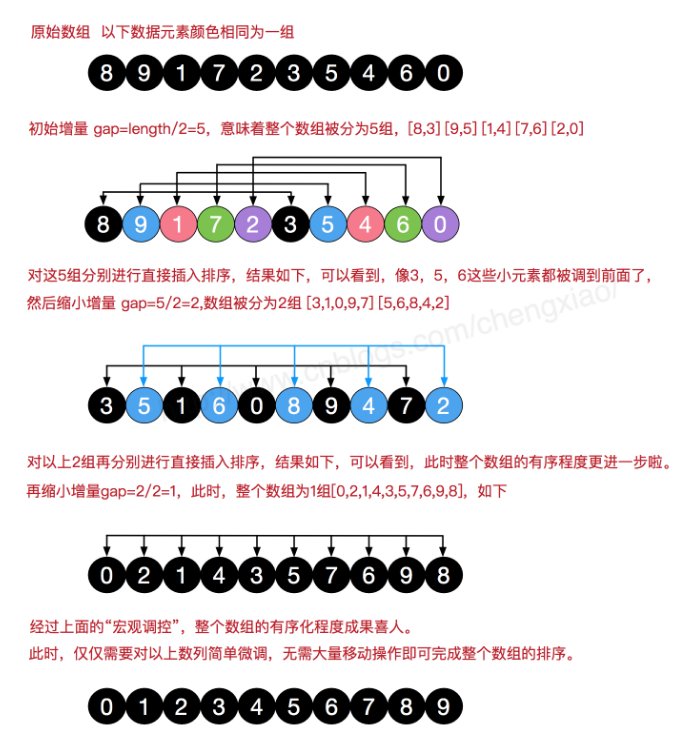
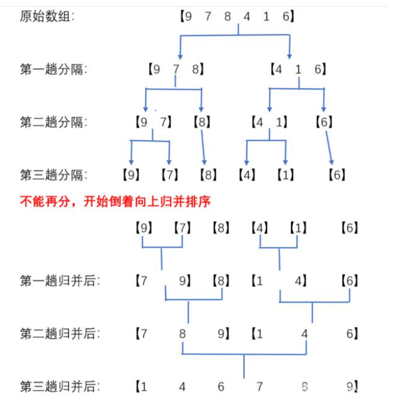

---

# 设置作者
author: Avery
# 设置写作时间
date: 2022-07-31
# 一个页面可以有多个分类
category:
  - 数据结构与算法
# 一个页面可以有多个标签
tag:
  - 数据结构
# 此页面会在文章列表置顶
sticky: true
# 此页面会出现在首页的文章板块中
star: true
# 你可以自定义页脚
footer: 
---


# 经典排序

## 冒泡排序

冒泡排序的原理：
每一趟只能确定将一个数归位。即第一趟只能确定将末位上的数归位，第二趟只能将倒数第 2 位上的数归位，依次类推下去。如果有 n 个数进行排序，只需将 n-1 个数归位，也就是要进行 n-1 趟操作。

而 “每一趟 ” 都需要从第一位开始进行相邻的两个数的比较，将较大的数放后面，比较完毕之后向后挪一位继续比较下面两个相邻的两个数大小关系，重复此步骤，直到最后一个还没归位的数。


- 普通的冒泡排序

```js
function bubbleSort(arr) {
  console.time("普通冒泡耗时");
  let size = arr.length;
  for (let i = 0; i < size - 1; i++) {
    for (let j = 0; j < size - 1 - i; j++) {
      if (arr[j] > arr[j + 1]) {
        let temp = arr[j];
        arr[j] = arr[j + 1];
        arr[j + 1] = temp;
      }
    }
  }
  console.timeEnd("普通冒泡耗时");
  return arr;
}
```

- 改进冒泡排：通过设置一标志性变量 pos,用于记录每趟排序中最后一次进行交换的位置。由于 pos 位置之后的记录均已交换到位,故在进行下一趟排序时只要扫描到 pos 位置即可。

```js
function bubbleSort2(arr) {
  console.time("改进冒泡1耗时");
  let size = arr.length;
  let i = size - 1;
  while (i > 0) {
    let pos = 0;
    for (let j = 0; j < i; j++) {
      if (arr[j] > arr[j + 1]) {
        let tmp = arr[j];
        arr[j] = arr[j + 1];
        arr[j + 1] = tmp;
        pos = j;
      }
    }
    i = pos;
  }
  console.timeEnd("改进冒泡1耗时");
  return arr;
}
```

- 改进冒泡排序 2：传统冒泡排序中每一趟排序操作只能找到一个最大值或最小值,我们考虑利用在每趟排序中进行正向和反向两遍冒泡的方法一次可以得到两个最终值(最大者和最小者) , 从而使排序趟数几乎减少了一半。

```js
function bubbleSort3(arr) {
  console.time("改进冒泡2耗时");
  let low = 0;
  let height = arr.length - 1;
  let tmp, j;
  while (low < height) {
    for (j = low; j < height; ++j) {
      if (arr[j] > arr[j + 1]) {
        tmp = arr[j];
        arr[j] = arr[j + 1];
        arr[j + 1] = tmp;
      }
    }
    --height;
    for (j = height; j > low; --j) {
      if (arr[j] < arr[j - 1]) {
        tmp = arr[j];
        arr[j] = arr[j - 1];
        arr[j - 1] = tmp;
      }
    }
    ++low;
  }
  console.timeEnd("改进冒泡2耗时");
  return arr;
}
let arr = [3, 44, 38, 5, 47, 15, 36, 26, 27, 2, 46, 4, 19, 50, 48];
// console.log(bubbleSort(arr));
// console.log(bubbleSort2(arr));
console.log(bubbleSort3(arr));
```

## 选择排序

选择排序(Selection-sort)是一种简单直观的排序算法。它的工作原理：首先在未排序序列中找到最小（大）元素，存放到排序序列的起始位置，然后，再从剩余未排序元素中继续寻找最小（大）元素，然后放到已排序序列的末尾。以此类推，直到所有元素均排序完毕。

```js
function selectSort(arr) {
  console.time("选择排序耗时");
  let miniIndex = 0;
  for (let i = 0; i < arr.length; i++) {
    miniIndex = i;
    for (let j = i + 1; j < arr.length; j++) {
      if (arr[j] < arr[miniIndex]) {
        miniIndex = j;
      }
    }
    let tmp = arr[i];
    arr[i] = arr[miniIndex];
    arr[miniIndex] = tmp;
  }
  console.timeEnd("选择排序耗时");
  return arr;
}

let selectArr = [3, 44, 38, 5, 47, 15, 36, 26, 27, 2, 46, 4, 19, 50, 48];
console.log(selectSort(selectArr));
```

## 插入排序

插入排序（Insertion-Sort）的算法描述是一种简单直观的排序算法。它的工作原理是通过构建有序序列，对于未排序数据，在已排序序列中从后向前扫描，找到相应位置并插入。插入排序在实现上，通常采用 in-place 排序（即只需用到 O(1)的额外空间的排序），因而在从后向前扫描过程中，需要反复把已排序元素逐步向后挪位，为最新元素提供插入空间。

```js
function insertSort(arr) {
  console.time("插入排序耗时");
  let i = 1;
  while (i < arr.length) {
    let key = arr[i];
    let j = i - 1;
    while (j >= 0 && key < arr[j]) {
      arr[j + 1] = arr[j];
      j--;
    }
    arr[j + 1] = key;
    i++;
  }
  console.timeEnd("插入排序耗时");
  return arr;
}
let insertArr = [3, 44, 38, 5, 47, 15, 36, 26, 27, 2, 46, 4, 19, 50, 48];
console.log(insertSort(insertArr));
```

- 改进插入排序：通过对前面排序好的数据区进行二分查找，找到那个区域，low 值的右边就是我们要挪动的，low 值就为我们要插入的值

  ```js
  // 改进后的插入排序
  function insertSort1(arr) {
    console.time("插入排序改进的耗时");
    for (let i = 1; i < arr.length; i++) {
      let key = arr[i];
      let low = 0;
      let height = i - 1;
      while (low <= height) {
        let mid = Math.floor((low + height) / 2);
        if (arr[mid] > key) {
          height = mid - 1;
        } else if (arr[mid] < key) {
          low = mid + 1;
        }
      }
      for (let j = i - 1; j >= low; j--) {
        arr[j + 1] = arr[j];
      }
      arr[low] = key;
    }
    console.timeEnd("插入排序改进的耗时");
    return arr;
  }
  let insertArr = [3, 44, 38, 5, 47, 15, 36, 26, 27, 2, 46, 4, 19, 50, 48];
  console.log(insertSort1(insertArr));
  ```

## 希尔排序

- 希尔排序（Shellsort）也是一种插入排序，它是简单插入排序经过改进之后的一个更高效的版本，也称为缩小增量排序。希尔（Donald Shell）于 1959 年提出这种排序算法。

- 希尔排序是**非稳定排序算法**。

- **希尔排序是把数据序列按下标的一定增量分组，对每组使用直接插入排序算法排序；**

- **随着增量逐渐减少，每组包含的数据个数越来越多，当增量减至 1 时，整个文件恰被分成一组，整个数据序列就已经排序好了，算法便终止。**



```js
// 希尔排序
function shellSort(arr) {
  let gap = Math.floor(arr.length / 2);
  for (gap; gap >= 1; gap = Math.floor(gap / 2)) {
    for (let i = gap; i < arr.length; i++) {
      let temp = arr[i];
      let j;
      for (j = i - gap; j >= 0 && temp < arr[j]; j = j - gap) {
        arr[j + gap] = arr[j];
      }
      arr[j + gap] = temp;
    }
  }
  return arr;
}
let shellArr = [3, 44, 38, 5, 47, 15, 36, 26, 27, 2, 46, 4, 19, 50, 48];
console.log(shellSort(shellArr));
```

## 归并排序

归并排序是建立在归并操作上的一种有效的排序算法。该算法是采用分治法（Divide and Conquer）的一个非常典型的应用。归并排序是一种稳定的排序方法。将已有序的子序列合并，得到完全有序的序列；即先使每个子序列有序，再使子序列段间有序。若将两个有序表合并成一个有序表，称为 2-路归并。



```js
// 归并排序
function mergeSort(arr) {
  if (arr.length < 2) {
    return arr;
  }
  let mid = Math.floor(arr.length / 2);
  let left = arr.slice(0, mid);
  let right = arr.slice(mid, arr.length);
  return merge(mergeSort(left), mergeSort(right));
}
function merge(left, right) {
  let res = [];
  while (left.length && right.length) {
    if (left[0] < right[0]) {
      res.push(left.shift());
    } else {
      res.push(right.shift());
    }
  }
  while (left.length) {
    res.push(left.shift());
  }
  while (right.length) {
    res.push(right.shift());
  }
  return res;
}
let mergeArr = [3, 44, 38, 5, 47, 15, 36, 26, 27, 2, 46, 4, 19, 50, 48];
console.log(mergeSort(mergeArr));
```

## 快速排序

快速排序的基本思想：通过一趟排序将待排记录分隔成独立的两部分，其中一部分记录的关键字均比另一部分的关键字小，则可分别对这两部分记录继续进行排序，以达到整个序列有序。

快速排序使用分治法来把一个串（list）分为两个子串（sub-lists）。具体算法描述如下：

- 从数列中挑出一个元素，称为 "基准"（pivot）；
- 重新排序数列，所有元素比基准值小的摆放在基准前面，所有元素比基准值大的摆在基准的后面（相同的数可以到任一边）。在这个分区退出之后，该基准就处于数列的中间位置。这个称为分区（partition）操作；
- 递归地（recursive）把小于基准值元素的子数列和大于基准值元素的子数列排序。

```js
function quickSort(arr) {
  if (arr.length <= 1) return arr;
  let pivotIndex = Math.floor(arr.length / 2);
  let pivot = arr.splice(pivotIndex, 1)[0];
  let left = [];
  let right = [];
  for (let i = 0; i < arr.length; i++) {
    if (arr[i] < pivot) {
      left.push(arr[i]);
    } else {
      right.push(arr[i]);
    }
  }
  return quickSort(left).concat([pivot], quickSort(right));
}
let quickArr = [3, 44, 38, 5, 47, 15, 36, 26, 27, 2, 46, 4, 19, 50, 48];
console.log(quickSort(quickArr));
```

## 堆排序

具体算法描述如下：

- 将初始待排序关键字序列(R1,R2....Rn)构建成大顶堆，此堆为初始的无序区；
- 将堆顶元素 R[1]与最后一个元素 R[n]交换，此时得到新的无序区(R1,R2,......Rn-1)和新的有序区(Rn),且满足 R[1,2...n-1]<=R[n]；
- 由于交换后新的堆顶 R[1]可能违反堆的性质，因此需要对当前无序区(R1,R2,......Rn-1)调整为新堆，然后再次将 R[1]与无序区最后一个元素交换，得到新的无序区(R1,R2....Rn-2)和新的有序区(Rn-1,Rn)。不断重复此过程直到有序区的元素个数为 n-1，则整个排序过程完成。

```js
function heapify(arr, len, i) {
  let left = i * 2 + 1,
    right = i * 2 + 2;
  let max = i;
  if (left < len && arr[left] > arr[max]) {
    max = left;
  }
  if (right < len && arr[right] > arr[max]) {
    max = right;
  }
  if (max != i) {
    let tmp = arr[i];
    arr[i] = arr[max];
    arr[max] = tmp;
    heapify(arr, len, max);
  }
}

function heapifySort(arr) {
  for (let i = Math.floor(arr.length / 2) - 1; i >= 0; i--) {
    heapify(arr, arr.length, i);
  }
  for (let j = arr.length - 1; j > 0; j--) {
    let tmp = arr[0];
    arr[0] = arr[j];
    arr[j] = tmp;
    heapify(arr, j, 0);
  }
  return arr;
}
let heapArr = [3, 44, 38, 5, 47, 15, 36, 26, 27, 2, 46, 4, 19, 50, 48];
console.log(heapifySort(heapArr));
```

## 计数排序

计数排序的核心在于将输入的数据值转化为键存储在额外开辟的数组空间中。 作为一种线性时间复杂度的排序，计数排序要求输入的数据必须是有确定范围的整数。

- 找出待排序的数组中最大和最小的元素；
- 统计数组中每个值为 i 的元素出现的次数，存入数组 C 的第 i 项；
- 对所有的计数累加（从 C 中的第一个元素开始，每一项和前一项相加）；
- 反向填充目标数组：将每个元素 i 放在新数组的第 C(i)项，每放一个元素就将 C(i)减去 1。

```js
function countingSort(arr) {
  let max = arr[0];
  let count = [];
  let res = [];
  for (let i = 0; i < arr.length; i++) {
    max = Math.max(max, arr[i]);
    count[arr[i]] = count[arr[i]] ? count[arr[i]] + 1 : 1;
  }

  for (let j = 1; j < max + 1; j++) {
    count[j + 1] = (count[j] || 0) + (count[j + 1] || 0);
  }

  for (let k = 0; k < arr.length; k++) {
    res[count[arr[k]] - 1] = arr[k];
    count[arr[k]]--;
  }

  return res;
}
let countArr = [3, 44, 38, 5, 47, 15, 36, 26, 27, 2, 46, 4, 19, 50, 48];
console.log(countingSort(countArr));
```
