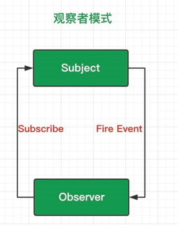
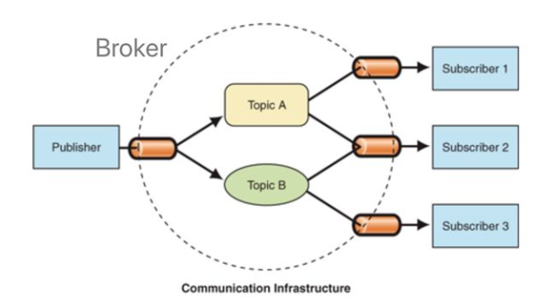

---

# 设置作者
author: Avery
# 设置写作时间
date: 2022-07-20
# 一个页面可以有多个分类
category:
  - 设计模式
# 一个页面可以有多个标签
tag:
  - 设计模式
# 此页面会在文章列表置顶
sticky: true
# 此页面会出现在首页的文章板块中
star: true
# 你可以自定义页脚
footer: 
---

# 观察者模式 vs 发布订阅模式

## 观察者模式

观察者模式定义了对象间的一种一对多的依赖关系，当一个对象的状态发生改变时，所有依赖于它的对象都将得到通知，并自动更新。观察者模式属于行为型模式，行为型模式关注的是对象之间的通讯，观察者模式就是观察者和被观察者之间的通讯。

观察者模式有一个别名叫“发布-订阅模式”，或者说是“订阅-发布模式”，订阅者和订阅目标是联系在一起的，当订阅目标发生改变时，逐个通知订阅者。我们可以用报纸期刊的订阅来形象的说明，当你订阅了一份报纸，每天都会有一份最新的报纸送到你手上，有多少人订阅报纸，报社就会发多少份报纸，报社和订报纸的客户就是上面文章开头所说的“一对多”的依赖关系。

观察者模式，其实是为了实现 **松耦合(loosely coupled)**

在观察者模式里，如果我们想要调用一个方法，而不改变方法内部的代码，那我们用这调用方法的实例对象，就是被观察者(Subject或者 Observable)，只需要维护一套观察者(Observer)的集合，这些Observer实现相同的接口，Subject只需要知道，通知Observer时，需要调用哪个统一方法就好。

## 发布订阅模式

其实24种基本的设计模式中并没有发布订阅模式，上面也说了，他只是观察者模式的一个别称。

但是经过时间的沉淀，似乎他已经强大了起来，已经独立于观察者模式，成为另外一种不同的设计模式。

在现在的发布订阅模式中，称为发布者的消息发送者不会将消息直接发送给订阅者，这意味着发布者和订阅者不知道彼此的存在。在发布者和订阅者之间存在第三个组件，称为调度中心或事件通道，它维持着发布者和订阅者之间的联系，过滤所有发布者传入的消息并相应地分发它们给订阅者。

举一个例子，你在微博上关注了A，同时其他很多人也关注了A，那么当A发布动态的时候，微博就会为你们推送这条动态。A就是发布者，你是订阅者，微博就是调度中心，你和A是没有直接的消息往来的，全是通过微博来协调的（你的关注，A的发布动态）。

**在发布订阅模式里，发布者，并不会直接通知订阅者，换句话说，发布者和订阅者，彼此互不相识。**

互不相识？那他们之间如何交流？

**答案是，通过第三者，也就是在消息队列里面，我们常说的经纪人Broker。**

发布者只需告诉Broker，我要发的消息，topic是AAA；

订阅者只需告诉Broker，我要订阅topic是AAA的消息；

于是，当Broker收到发布者发过来消息，并且topic是AAA时，就会把消息推送给订阅了topic是AAA的订阅者。当然也有可能是订阅者自己过来拉取，看具体实现。

**也就是说，发布订阅模式里，发布者和订阅者，不是松耦合，而是完全解耦的。**

## 总结

从表面上看：

- 观察者模式里，只有两个角色 —— 观察者 + 被观察者
- 而发布订阅模式里，却不仅仅只有发布者和订阅者两个角色，还有一个经常被我们忽略的 —— 经纪人Broker

往更深层次讲：

- 观察者和被观察者，是松耦合的关系
- 发布者和订阅者，则完全不存在耦合

从使用层面上讲：

- 观察者模式，多用于单个应用内部
- 发布订阅模式，则更多的是一种跨应用的模式(cross-application pattern)，比如我们常用的消息中间件