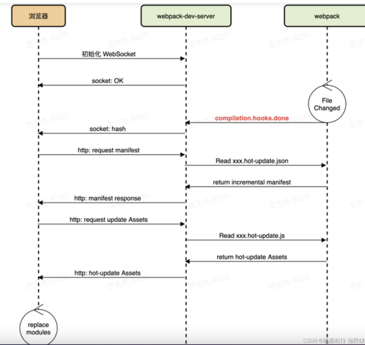
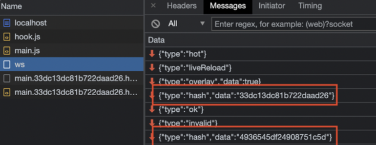
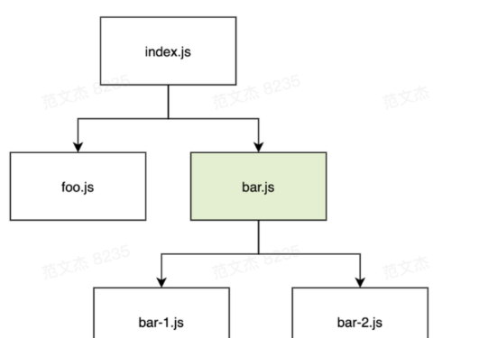

---

# 设置作者
author: Avery
# 设置写作时间
date: 2022-07-20
# 一个页面可以有多个分类
category:
  - 前端工程化
# 一个页面可以有多个标签
tag:
  - 前端工程化
  - webpack
# 此页面会在文章列表置顶
sticky: true
# 此页面会出现在首页的文章板块中
star: true
# 你可以自定义页脚
footer: 
---

# webpack

## optimization（优化）

webpack的runtimeChunk怎么生成

将`optimization.runtimeChunk`设置为`true`或`multiple`，会为每个入口添加一个只含有runtime的额外chunk

**webpack.config.js**

```
module.exports = {
  //...
  optimization: {
    runtimeChunk: {
      name: (entrypoint) => `runtime~${entrypoint.name}`,
    },
  },
};
```

值 `"single"` 会创建一个在所有生成 chunk 之间共享的运行时文件。此设置是如下设置的别名：

**webpack.config.js**

```
module.exports = {
  //...
  optimization: {
    runtimeChunk: {
      name: 'runtime',
    },
  },
};
```

通过将 `optimization.runtimeChunk` 设置为 `object`，对象中可以设置只有 `name` 属性，其中属性值可以是名称或者返回名称的函数，用于为 runtime chunks 命名。

默认值是 `false`：每个入口 chunk 中直接嵌入 runtime。

## 模块热替换(hot module replacement)

模块热替换(HMR - hot module replacement)功能会在应用程序运行过程中，替换、添加或删除 [模块](https://webpack.docschina.org/concepts/modules/)，而无需重新加载整个页面。主要是通过以下几种方式，来显著加快开发速度：

- 保留在完全重新加载页面期间丢失的应用程序状态。
- 只更新变更内容，以节省宝贵的开发时间。
- 在源代码中 CSS/JS 产生修改时，会立刻在浏览器中进行更新，这几乎相当于在浏览器 devtools 直接更改样式。

运行：

通过以下步骤，可以做到在应用程序中置换(swap in and out)模块：

1. 应用程序要求 HMR runtime 检查更新。
2. HMR runtime 异步地下载更新，然后通知应用程序。
3. 应用程序要求 HMR runtime 应用更新。
4. HMR runtime 同步地应用更新。

你可以设置 HMR，以使此进程自动触发更新，或者你可以选择要求在用户交互时进行更新。

### 在 compiler 中

除了普通资源，compiler 需要发出 "update"，将之前的版本更新到新的版本。"update" 由两部分组成：

1. 更新后的 [manifest](https://webpack.docschina.org/concepts/manifest) (JSON)
2. 一个或多个 updated chunk (JavaScript)

manifest 包括新的 compilation hash 和所有的 updated chunk 列表。每个 chunk 都包含着全部更新模块的最新代码（或一个 flag 用于表明此模块需要被移除）。

compiler 会确保在这些构建之间的模块 ID 和 chunk ID 保持一致。通常将这些 ID 存储在内存中（例如，使用 [webpack-dev-server](https://webpack.docschina.org/configuration/dev-server/) 时），但是也可能会将它们存储在一个 JSON 文件中。

### 在模块中

HMR 是可选功能，只会影响包含 HMR 代码的模块。举个例子，通过 [`style-loader`](https://github.com/webpack-contrib/style-loader) 为 style 追加补丁。为了运行追加补丁，`style-loader` 实现了 HMR 接口；当它通过 HMR 接收到更新，它会使用新的样式替换旧的样式。

类似的，当在一个模块中实现了 HMR 接口，你可以描述出当模块被更新后发生了什么。然而在多数情况下，不需要在每个模块中强行写入 HMR 代码。如果一个模块没有 HMR 处理函数，更新就会冒泡(bubble up)。这意味着某个单独处理函数能够更新整个模块树。如果在模块树的一个单独模块被更新，那么整组依赖模块都会被重新加载。

### 在 runtime 中

对于模块系统运行时(module system runtime)，会发出额外代码，来跟踪模块 `parents` 和 `children` 关系。在管理方面，runtime 支持两个方法 `check` 和 `apply`。

`check` 方法，发送一个 HTTP 请求来更新 manifest。如果请求失败，说明没有可用更新。如果请求成功，会将 updated chunk 列表与当前的 loaded chunk 列表进行比较。每个 loaded chunk 都会下载相应的 updated chunk。当所有更新 chunk 完成下载，runtime 就会切换到 `ready` 状态。

`apply` 方法，将所有 updated module 标记为无效。对于每个无效 module，都需要在模块中有一个 update handler，或者在此模块的父级模块中有 update handler。否则，会进行无效标记冒泡，并且父级也会被标记为无效。继续每个冒泡，直到到达应用程序入口起点，或者到达带有 update handler 的 module（以最先到达为准，冒泡停止）。如果它从入口起点开始冒泡，则此过程失败。

之后，所有无效 module 都会被（通过 dispose handler）处理和解除加载。然后更新当前 hash，并且调用所有 `accept` handler。runtime 切换回 `idle` 状态，一切照常继续。

### HMR核心流程

1. 使用 webpack-dev-server (后面简称 WDS)托管静态资源，同时以 Runtime 方式注入 HMR 客户端代码；
2. 浏览器加载页面后，与 WDS 建立 WebSocket 连接；
3. Webpack 监听到文件变化后，增量构建发生变更的模块，并通过 WebSocket 发送 hash 事件；
4. 浏览器接收到 hash 事件后，请求 manifest 资源文件，确认增量变更范围；
5. 浏览器加载发生变更的增量模块；
6. Webpack 运行时触发变更模块的 module.hot.accept 回调，执行代码变更逻
7. done；

### Hot Module Replacement 原理的关键部分

#### 1.注入 HMR 客户端运行时

- 执行 npx webpack serve 命令后，WDS 调用 HotModuleReplacementPlugin 插件向应用的主 Chunk 注入一系列 HMR Runtime，包括：


- 用于建立 WebSocket 连接，处理 hash 等消息的运行时代码；
- 用于加载热更新资源的 RuntimeGlobals.hmrDownloadManifest 与 RuntimeGlobals.hmrDownloadUpdateHandlers 接口；
- 用于处理模块更新策略的 module.hot.accept 接口；


经过 HotModuleReplacementPlugin 处理后，构建产物中即包含了所有运行 HMR 所需的客户端运行时与接口。这些 HMR 运行时会在浏览器执行一套基于 WebSocket 消息的时序框架，如图： 



#### 2.增量构建

除注入客户端代码外，HotModuleReplacementPlugin 插件还会借助 Webpack 的 watch 能力，在代码文件发生变化后执行增量构建，生成：

- manifest 文件：JSON 格式文件，包含所有发生变更的模块列表，命名为 [hash].hot-update.json；

- 模块变更文件：js 格式，包含编译后的模块代码，命名为 [hash].hot-update.js；

- 增量构建完毕后，Webpack 将触发 compilation.hooks.done 钩子，并传递本次构建的统计信息对象 stats。WDS 则监听 done 钩子，在回调中通过 WebSocket 发送模块更新消息：

  {"type":"hash","data":"${stats.hash}"}实际效果：
  

注意，在 Webpack 4 及之前，热更新文件以模块为单位，即所有发生变化的模块都会生成对应的热更新文件； Webpack 5 之后热更新文件以 chunk 为单位，如上例中，main chunk 下任意文件的变化都只会生成 main.[hash].hot-update.js 更新文件。 
manifest 请求完成后，客户端 HMR 运行时开始下载发生变化的 chunk 文件，将最新模块代码加载到本地。

#### 3.module.hot.accept回调

经过上述步骤，浏览器加载完最新模块代码后，HMR 运行时会继续触发 module.hot.accept 回调，将最新代码替换到运行环境中。

module.hot.accept 是 HMR 运行时暴露给用户代码的重要接口之一，它在 Webpack HMR 体系中开了一个口子，让用户能够自定义模块热替换的逻辑。module.hot.accept 接口签名如下：

module.hot.accept(path?: string, callback?: function);它接受两个参数：

path：指定需要拦截变更行为的模块路径
callback：模块更新后，将最新模块代码应用到运行环境的函数例如，对于如下代码：  

```

// src/bar.jsexport const bar = 'bar'
// src/index.js
 
import { bar } from './bar';
const node = document.createElement('div')
node.innerText = bar;
document.body.appendChild(node)
module.hot.accept('./bar.js', function () { node.innerText = bar;})

```

示例中，module.hot.accept 函数监听 ./bar.js 模块的变更事件，一旦代码发生变动就触发回调，将 ./bar.js 导出的值应用到页面上，从而实现热更新效果。

##### 4.1失败兜底

module.hot.accept 函数只接受具体路径的 path 参数，也就是说我们无法通过 glob 或类似风格的方式批量注册热更新回调。

一旦某个模块没有注册对应的 module.hot.accept 函数后，HMR 运行时会执行兜底策略，通常是刷新页面，确保页面上运行的始终是最新的代码。


##### 4.2更新事件冒泡

在 Webpack HMR 框架中，module.hot.accept 函数只能捕获当前模块对应子孙模块的更新事件



示例中，更新事件会沿着模块依赖树自底向上逐级传递，从 foo 到 index ，从 bar-1 到 bar 再到 index，但不支持反向或跨子树传递，也就是说：

在 foo.js 中无法捕获 bar.js 及其子模块的变更事件；
在 bar-1.js 中无法捕获 bar.js 的变更事件
这一特性与 DOM 事件规范中的冒泡过程极为相似，使用时如果摸不准模块的依赖关系，建议直接在应用的入口文件中编写热更新函数。

##### 4.3无参数调用

除上述调用方式外，module.hot.accept 函数还支持无参数调用风格，作用是捕获当前文件的变更事件，并从模块第一行开始重新运行该模块的代码，例如：

// src/bar.jsconsole.log('bar');module.hot.accept();示例模块发生变动之后，会从头开始重复执行 console.log 语句。
